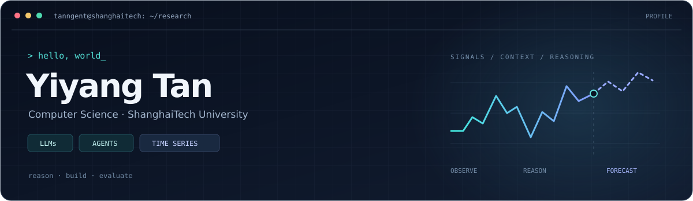

  

  <a href="mailto:tanyy2023@shanghaitech.edu.cn">Email</a> ·
  <a href="https://tanngent2005.github.io/">Blog</a> ·
  <a href="https://foundation-model-research.github.io/KairosAgent/">KairosAgent</a>

## `01 / about`

Hi, I'm **Yiyang Tan (谭逸扬)**, a Computer Science undergraduate at **ShanghaiTech University** (2023–2027, expected).

I'm interested in **large language models, AI agents, and multimodal time series forecasting**. My research interests center on how agents use context and tools, how we evaluate their capabilities, and when we can trust their predictions.

- **Research:** LLMs & Agents · Time Series + Text · Benchmarking & Evaluation
- **Exploring:** Agentic reinforcement learning and confidence-aware forecasting
- **Teaching:** Teaching assistant for **CS100 — Introduction to Programming**
- **Contact:** [tanyy2023@shanghaitech.edu.cn](mailto:tanyy2023@shanghaitech.edu.cn)

## `02 / selected research`

### KairosAgent · EMNLP 2026 Main Conference

**[KairosAgent: Agentic Time Series Forecasting with Fused Semantic Reasoning](https://arxiv.org/abs/2605.30002)**

Combining LLM-based semantic reasoning with time series foundation models for multimodal forecasting. My contributions include baseline experiments, inference workflow debugging, and results and error analysis.

[Paper](https://arxiv.org/abs/2605.30002) · [Project page](https://foundation-model-research.github.io/KairosAgent/)

### Current research interests

| Area | Questions I'm exploring |
| :--- | :--- |
| **Multimodal time series evaluation** | When does textual context improve forecasts, and how can we measure its contribution? |
| **Predictability & confidence** | How should model confidence relate to the information available in time series and text? |
| **LLM agents & reinforcement learning** | How can tool use, feedback, and evaluation support more reliable agent behavior? |

## `03 / toolkit`

| | Technologies |
| :--- | :--- |
| **Languages** | Python · C/C++ · Go · C# |
| **Machine learning** | PyTorch · Lightning · NumPy · OpenCV |
| **Experiments & infrastructure** | Linux · Git · Docker · Slurm |
| **Backend & visualization** | PostgreSQL · Redis · Unity · OpenGL |

<b>More about my background</b>

### Selected project experience

- **Structured Information Bottleneck / PTIB:** experimental analysis, visualization, and research reporting.
- **Systems & software:** C++ game development, RISC-V coursework, and Go backend development.

### Foundations

Algorithms & Data Structures · Linear Algebra · Machine Learning · Deep Learning · Natural Language Processing · Computer Vision · Databases

---

Learning how to reason. Building things that work. Testing what we can trust.

